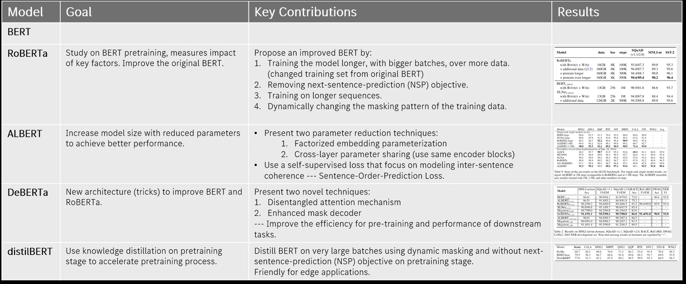

## ImmoFlatData
This project is designed to fetch Immobilien (real estate) data from a given source (e.g., a web API or website) and convert it into a flat data structure for easier manipulation and further analysis, reporting, or storage.
The system handles data extraction, transformation, and flattening of complex hierarchical structures into a tabular format, which is ideal for integration into data warehouses, spreadsheets, or databases.
The LLM-empowered RecSys provides personalize property suggestions by analyzing buyer preferences, needs, and market trends through natural language understanding and advanced data processing.

### Features
- **Data Fetching**: Fetches real estate data from multiple sources, such as APIs or web scraping. Transforms complex nested JSON or XML data into a simplified flat structure.
- **Flat Data Structure**: Outputs data in a tabular format (e.g., CSV, JSON, or database-friendly format).
- **merchandising strategies**: select and promote facets with deep learning
- **Personalized Recommendation**: individual investment recommandation in terms of real estate property

### Installation
Python 3.10+
```bash
pip install -r script/requirements.txt
http_proxy=  python script/fetcher.py
http_proxy=  python script/embedder.py
http_proxy=  python script/publisher.py
```

### Visualize
#### Backend Data
[Flat Viewer](https://flatgithub.com/neverset123/ImmoFlatData)
#### Frontend UI
[recommendation UI](https://www.notion.so/Immobilien-Recommender-1a9b015797468066be88c216eccc7ecf)
1. go to Preference Tab
2. input your preference text
3. exclusive recommendation is created after some minutes


## Misc
scraping discord: https://discord.com/channels/737009125862408274/774298515123208233/1331328539785429055
https://github.com/lavague-ai/LaVague
https://www.youtube.com/watch?v=QxHE4af5BQE
https://github.com/jina-ai/reader


```
docker build --network host -f trigger/Dockerfile -t neverset/immoagent:latest .
docker run --network host -e GITHUB_TOKEN= neverset/immoagent:latest 
```

1. fix commiter user
bash test.sh
git push --force --tags origin 'refs/heads/main'

2. publish 
https://blog.cloudboost.io/how-to-build-a-notion-web-app-with-almost-no-code-for-free-5d7c460e946d

3. scrapy and playwright
use scrapy and playwright: Since cookies are assigned for the first time, use Playwright to collect them and then inject them in a Scrapy POST call
```
scrapy startproject immo
scrapy genspider quotes_pagination http://quotes.toscrape.com/scroll
scrapy crawl quotes_pagination
```

4. captcha
use https://github.com/daijro/camoufox
https://github.com/NoahCardoza/CaptchaHarvester?tab=readme-ov-file

5. convert input to filter with bert


6. deployment platform
https://eu-central-1.run.claw.cloud/ (5$ monthly fee free)
7. fix json output
https://github.com/mangiucugna/json_repair
8. add DiffMem to enhence recommendation
9. add LLM SEO STS for recommendation[https://github.com/aounon/llm-rank-optimizer]
